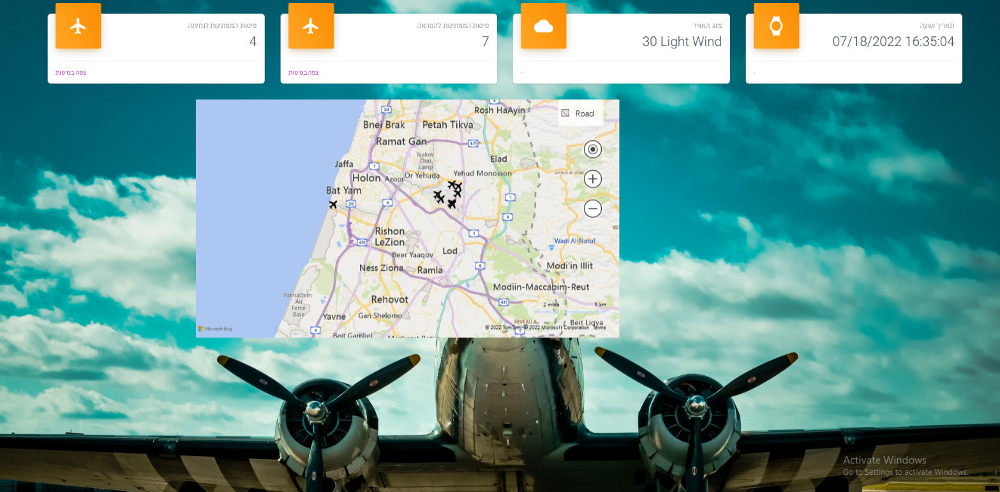
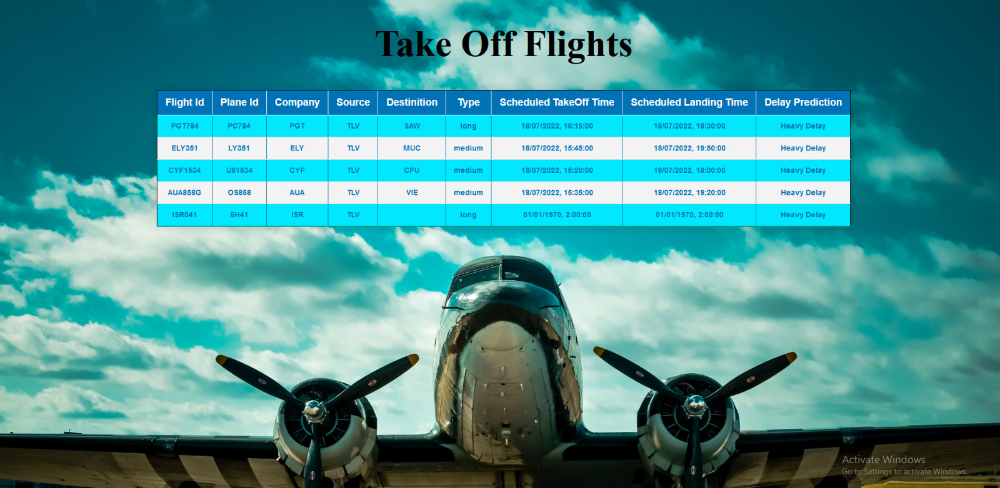
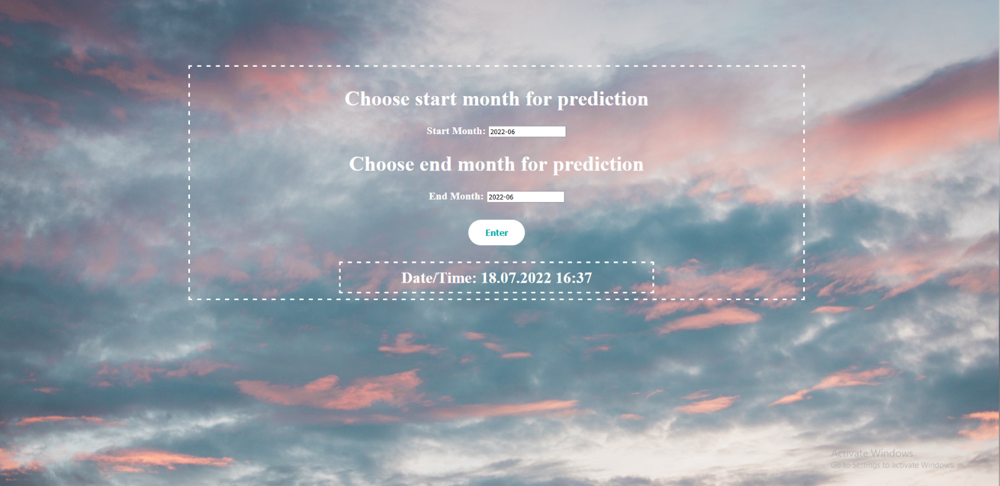

# Real Time Flights Radar

    Tal Abed, Roi Peleg

## The Main Site
In our dashboard you can see a map with the current location of the flights that are about to land in Ben-Gurion Airport in Tel Aviv or are about take off from it. You can also see cards with the following information:
- The amount of flights that are about to land in Ben-Gurion Airport
- The amount of flights that are about to take off from Ben-Gurion Airport
- The current temparature and weather in Tel Aviv
- the current time and date

In Addition, you can move to pages in which you can see a table with all the flights that are about land/takeoff. Each flight has information about it in the table:

### How does the site work?
To collect informatin about the flights we are doing HTTP requests from FlightsRadar24. We filter the information we got so we stay with only flights that are from or to Tel Aviv. Than we create a JSON for each flights we the details we want to show about the flight. 
When we have a list of flights JSON's we are sending it to Kafka, and from there, by using [KafkaConsumer](https://github.com/RoiPeleg/TLV-Flights-Predictions/blob/main/Dashboard_Server/Model/kafkaConsumer.js) we read the data into Redis database. 
To show the information in the dashboard and in the tables we read the data that is saved in Redis and present it in the site. The site is updating in real-time (not need to refresh). 
- We are doing the same thing with weather information.
 
In addition, we created a data based in MongoDB, in which we save all the historic data (all the data we collected). We are using this information to predict delay of flights (by using BigML). Once we predict delay of flight we are adding it to that flight JSON, so it it also saved in the Redis and can be shown in the tables. 
The user can select the months he wants the predictions to be based on from our secondary website:

